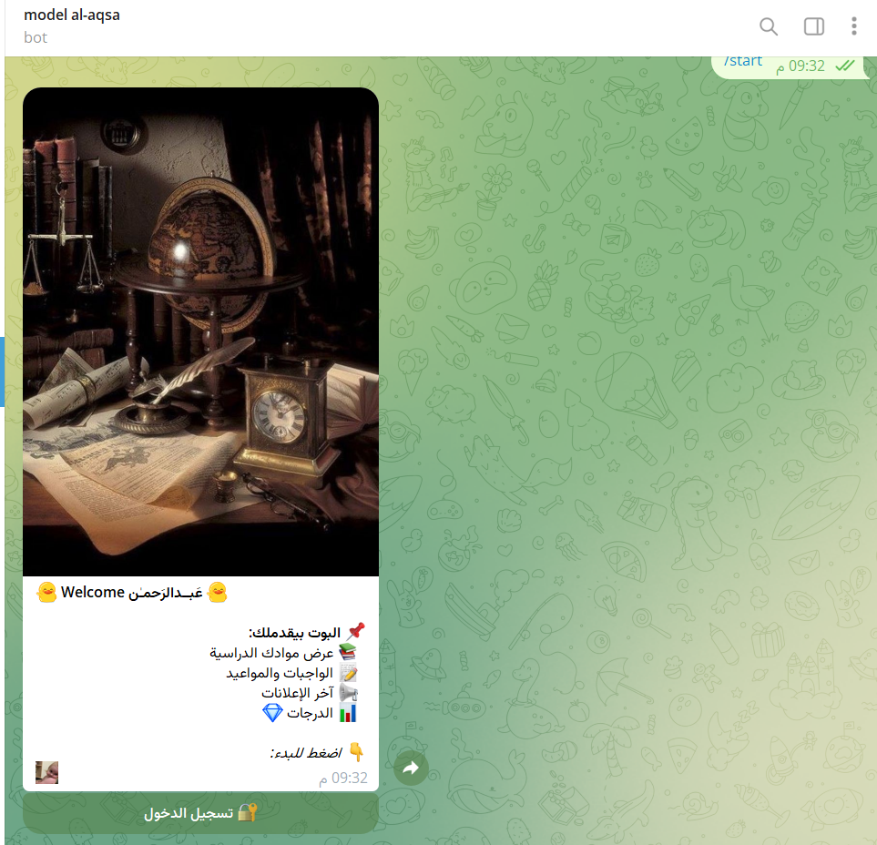
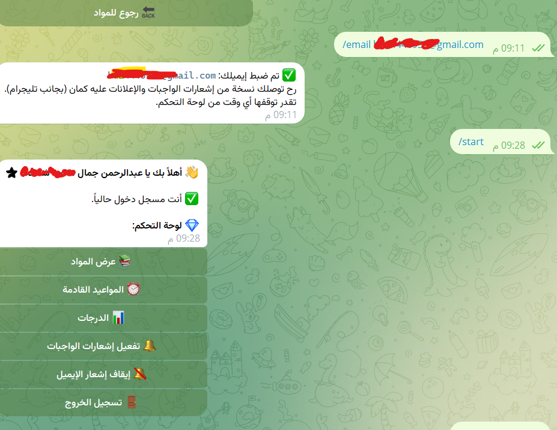
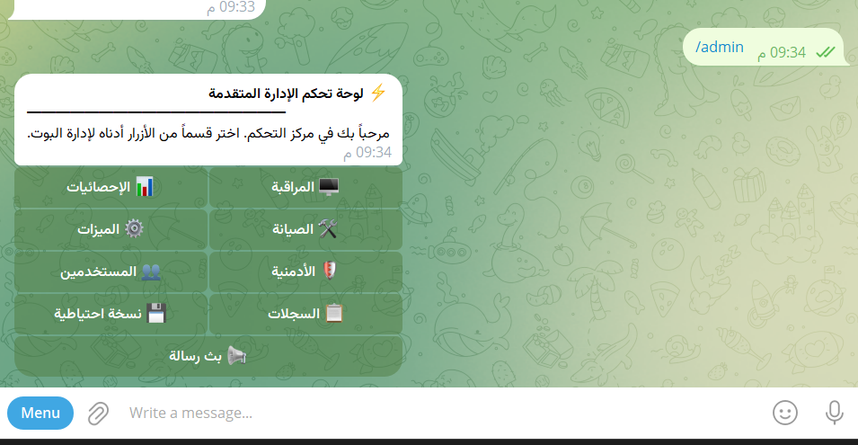
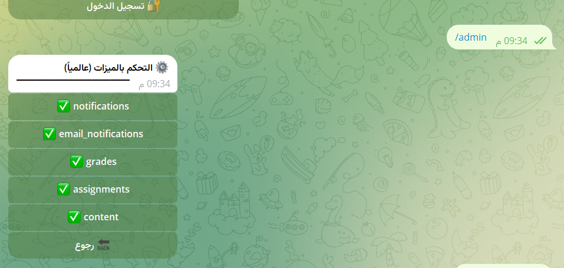

# 🎓 Moodle Telegram Bot - Advanced Academic Assistant

[](https://www.python.org/)
[](https://core.telegram.org/bots)
[](https://python-telegram-bot.org/)
[](LICENSE)

An advanced, feature-rich Telegram bot designed to integrate seamlessly with **Moodle LMS**. This bot serves as a personal academic assistant, helping students stay updated with their courses, assignments, and grades in real-time.

### 🤖 Live Demo
You can try the bot on Telegram: [@m_alaqsa_bot](https://t.me/m_alaqsa_bot)

---

## 🌟 Key Features

### 👨‍🎓 Student Dashboard
- **Course Overview**: View all enrolled courses with a single tap.
- **Assignments & Deadlines**: Stay on top of your tasks with upcoming deadline reminders.
- **Grades Tracking**: Instant access to your academic performance and grades.
- **Real-time Notifications**: Get notified immediately about new announcements, assignments, or grade updates.
- **Email Integration**: Receive academic updates directly in your inbox.

### 🛠 Admin & Management
- **Advanced Control Panel**: A comprehensive dashboard for bot administrators to monitor and manage the system.
- **Feature Toggles**: Enable or disable specific bot features (Notifications, Email, Admin Panel, etc.) globally without touching the code.
- **System Monitoring**: Track bot statistics, active users, and system health.
- **Security**: Robust encryption for user credentials using `cryptography`.

---

## 📸 Screenshots

<p align="center">
  
  
</p>
<p align="center">
  
  
</p>

---

## 🚀 Tech Stack

- **Language**: Python 3.10+
- **Bot Framework**: [python-telegram-bot](https://github.com/python-telegram-bot/python-telegram-bot) (v20.7)
- **Database**: [SQLAlchemy](https://www.sqlalchemy.org/) (ORM) with SQLite/PostgreSQL support.
- **Web Scraping**: [BeautifulSoup4](https://www.crummy.com/software/BeautifulSoup/) & `aiohttp`.
- **Scheduling**: [APScheduler](https://apscheduler.readthedocs.io/) for periodic background checks.
- **Security**: [Fernet Encryption](https://cryptography.io/en/latest/fernet/) for secure credential storage.
- **Admin Interface**: [Flask](https://flask.palletsprojects.com/) for the management dashboard.

---

## 🛠 Installation & Setup

1. **Clone the repository**:
   ```bash
   git clone https://github.com/your-username/moodle-bot.git
   cd moodle-bot
   ```

2. **Install dependencies**:
   ```bash
   pip install -r requirements.txt
   ```

3. **Configure Environment Variables**:
   Copy `.env.example` to `.env` and fill in your credentials:
   ```bash
   cp .env.example .env
   ```

4. **Run the bot**:
   ```bash
   python main.py
   ```

---

## 🔒 Security & Privacy

This project takes security seriously. All sensitive user credentials (like Moodle passwords) are encrypted before being stored in the database. The `ENCRYPTION_KEY` in your `.env` file is used to secure this data. **Never share your `.env` file or commit it to version control.**

---

## 👨‍💻 Developer

**Abodjmal** — Software Developer  

Passionate about building modern applications, clean architecture, and smooth user experiences.

### 🌐 Connect With Me

[](https://t.me/xw_25aa)
[](https://instagram.com/xw_.0)
[](https://github.com/abodjmal2004)

---

## 📄 License

This project is licensed under the MIT License - see the [LICENSE](LICENSE) file for details.

---

<p align="center">
  Developed with ❤️ for Students.
</p>
